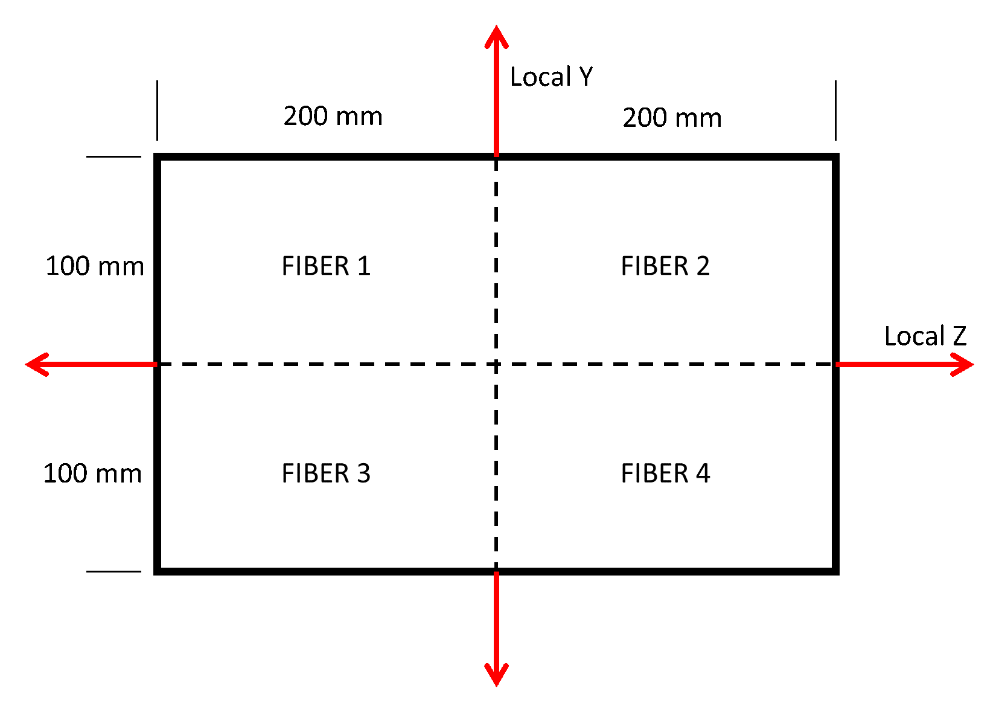
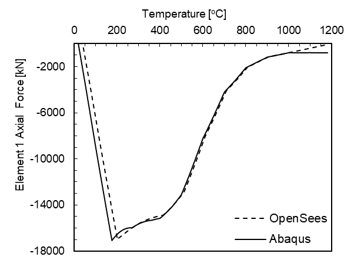
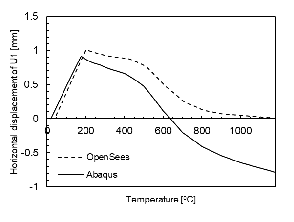

{.align-centeralign-center width="500px"}

Example overview: A steel beam of two equal elements is subjected to a
uniform temperature on only one of the elements. Element 1 remains at
ambient tempurature while Element 2 is heated using a linear
time-temperature history.

Download Example 2 files:

- [`Example2.tcl`](files/Example2.tcl)
- [Example 2 Outputs](files/EXAMPLE2_OUTPUT.zip)

## Objective

Example 2 Objectives:

1.  Develop a simply supported steel beam using displacement-based beam
    elements with tempurature-dependent material properites,
2.  Record internal forces of an element subjected to a linear
    time-temperature history due to the restraint against thermal
    expansion,
3.  Record displacement of a node due to a linear time-temperature
    history, and
4.  Correlate the recorded internal forces and displacement with the
    linear time-temperature history to plot the two variables as a
    function of temperature.

## Material

The uniaxialMaterial Steel01Thermal includes temperature-dependent steel
thermal and mechanical properties per Eurocode 3 \[1\]. More details of
Steel01 can be found at: [Steel01
Material](https://opensees.berkeley.edu/wiki/index.php/Steel01_Material)

```tcl
uniaxialMaterial Steel01Thermal $matTag $Fy $Es $b;
```

Es = 210 GPa (Young's modulus of elasticity at ambient temperatures)

Fy = 250 MPa (Yield strength of material at ambient temperatures)

b = 0.001 (Strain-Hardening Ratio)

## Transformation

The beam is expanding in one direction, therefore, 2nd order bending
effects do not need to be considered.

```tcl
geomTransf Linear $transftag;
```

Learn more about geometric transofrmations: [Geometric
Transformation](http://opensees.berkeley.edu/wiki/index.php/Geometric_Transformation_Command)

## Section

The discretization of the steel section into four fibers is shown using
the code below:

```tcl
section FiberThermal secTag -GJ $Es{

    set numSubdivIJ 2; \# horizontal division

    set numSubdivJK 2; \# vertical division

    set yI -100; #mm

    set zI -200; #mm

    set yJ 100; #mm

    set zJ -200; #mm

    set yK 100; #mm

    set zK 200; #mm

    set yL -100; #mm

    set zL 200; #mm

    patch quad $matTag $numSubdivIJ $numSubdivJK $yI $zI $yJ $zJ $yK $zK $yL $zL
}
```

Sections that will be subjected to thermal loading must be created with
fiberThermal or fibersecThermal.

In previous versions of OpenSees, a default value for torsional
stiffness was used (GJ). In versions 3.1.0 and newer fiber sections
require a value for torsional stiffness. This is a 2D example with
negligible torsion, however a value is required. The Young\'s Modulus is
used for convenience.

The discretization can be visualized as such:

{.align-centeralign-center width="400px"}


## Elements

dispBeamColumnThermal elements are used because temperature-dependent
thermal and mechanical steel properties can be applied to these
elements. Any portion of the structure that is being heated must use
elements that are compatible with uniaxialMaterial Steel01Thermal. At
the time this model was developed, dispBeamColumnThermal was the only
element type that could have tempurature-dependent thermal and
mechanical properties applied to them.

The beam is made of one element with 5 iteration points and connects
nodes 1 & 2. OpenSees is sensitive to the number of iteration points in
each element and this could change the result of the recorded
displacement. For this reason, it is important to perform these
benchmarking examples to establish how many iteration points allows for
convergence to the expected recorded displacement. To code the number of
iteration points, we use the following syntax:

dispBeamColumnThermal eleTag iNode jNode numIntgrPts secTag TransfTag;

Element 1

```tcl
element dispBeamColumnThermal 1 1 2 5 $secTag $transftag;
```

Element 2

```tcl
element dispBeamColumnThermal 1 2 3 5 $secTag $transftag;
```

## Output Recorders

Displacement of the middle of node (2) in DOF 1 (horizontal direction)
and the horizontal reaction force from the boundary conditions is what
we want to record. To do so, a folder within your working directory must
be created. `dataDir` is the command to create that folder and should be
defined at the beginning of the model. This is where your output files
will be saved.

```tcl
set dataDir Examples/EXAMPLE2_OUTPUT;
```

```tcl
file mkdir $dataDir;
```

Displacement of the middle node (2) in DOF 1 (Horizontal Displacement)

```tcl
recorder Node -file $dataDir/MidspanNodeDisp.out -time -node 2 -dof 1
disp;
```

Recording reactions at the boundary conditions:

```tcl
recorder Node -file $dataDir/BoundryRXN.out -time -node 1 3 -dof 1 2
reaction;
```

Recording the section forces in Elements 1 & 2:

```tcl
recorder Element -file $dataDir/ele_force_1.out -time -ele 1 section 2
force
```

```tcl
recorder Element -file $dataDir/ele_force_2.out -time -ele 2 section 2
force
```

Learn more about the Recorder Command: [Recorder Command
\<http://opensees.berkeley.edu/wiki/index.php/Recorder_Command>]{.title-ref}
\_\_

## Thermal Loading

This particular model is heating a beam to a set temperature over the
time period of the model. We are not asking OpenSees to use a specific
time-temperature curve, rather linearly ramp up the temperature from
ambient to 1180 &deg; C.

Therefore, we set the maximum temperature as follows:

T = Max Tempurature \[deg celcius\]

```tcl
set T 1180;
```

In OpenSees, the user can define 2 or 9 temperature data points through
the cross section. In a 2D analysis framework, like this example,
temperature data point locations are specified on the y-axis of the
local coordinate system (as shown in the figure above). And are linearly
interpolated between the defined points. Because this example is using a
uniformly heated beam, the entire cross section is one temperature, and
two temperature points on each extreme fiber on the y-axis will be
chosen. The beam has a depth of 200mm, therefore, Y1 = 100 mm & Y2 =
-100 mm for the top and bottom fibers respectively.

Location of bottom extreme fiber of beam \[mm\]

```tcl
set Y1 -100;
```

Location of top extreme fiber of beam \[mm\]

```tcl
set Y2 100;
```

{.align-centeralign-center width="500px"}

**Location of defined input temperature locations on the member cross
section**

The bottom extreme fiber temperature must be defined first. The target
maximum temperature for each extreme fiber is set to 1180 &deg; C and will
be increased incrementally and linearly as the time step continues in
the analysis. An external temperature data set can could also be used
for more complex temperature loading.

Element 1 will remain at ambient temperature 20 &deg; C, while Element 2
will be heated to the target tempurature. The syntax for this is:

```tcl
pattern Plain 1 Linear {eleLoad -ele 1 -type --beamThermal $T $Y2 $T
Y1; eleLoad -ele 2 -type --beamThermal $T $Y2 $T Y1 }
```

## Thermal Analysis

Thermal loading is applied in 1000 steps, with a load factor of 0.001.
Each step is a 0.001 increment of the maximum temperature specified in
the thermal loading step: `T`. The analysis is a static analysis and the
contraints of the beam are plain. 1000 increments was also used during
thermal analysis to allow for easy correlation between the input
temperatures and the recorded output.

A variety of load factors were examined and the solution converged when
a load factor of 0.001 was used. OpenSees is sensitive to the load
factor, therefore, it is important to ensure that benchmarking examples
are performed to determine the proper load factor to use in structural
fire engineering analyses.

```tcl
set Nsteps 1000

set Factor \[expr 1.0/$Nsteps\];

integrator LoadControl $Factor;

analyze $Nsteps;
```

## Output Plots

After the model has completed running, the results will be a horizontal
displacement of the recorded node, the internal forces in the elements,
and the reactions from the boundary conditions. Since the temperature
was linearly ramped up from ambient to 1180 &deg; C, the user can develop
a temperature history that matches every increment of the model.

{.align-centeralign-center width="500px"}

{.align-centeralign-center width="500px"}

## Sources

\[1\] European Committee for Standardization (CEN). (2005). Eurocode 3:
Design of Steel Structures, Part 1.2: General Rules - Structural Fire
Design.
