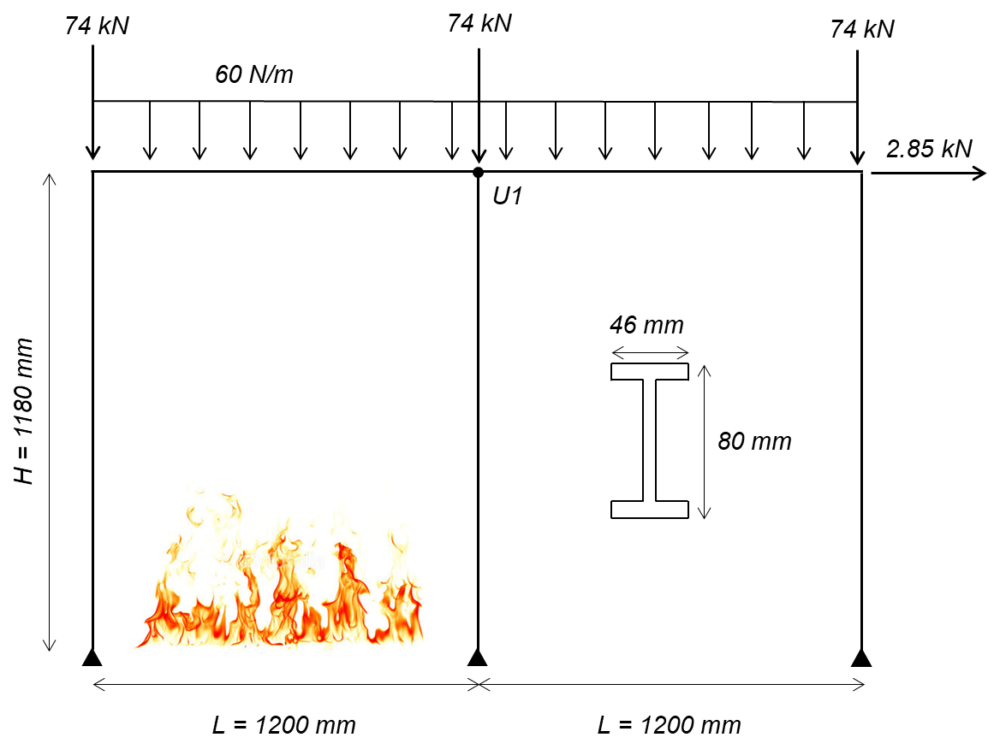
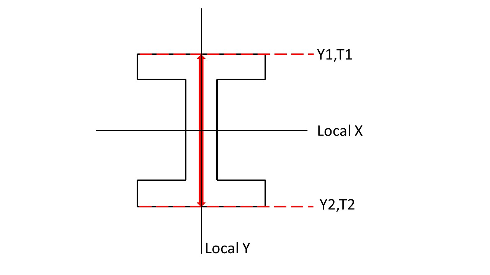
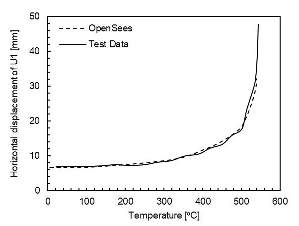
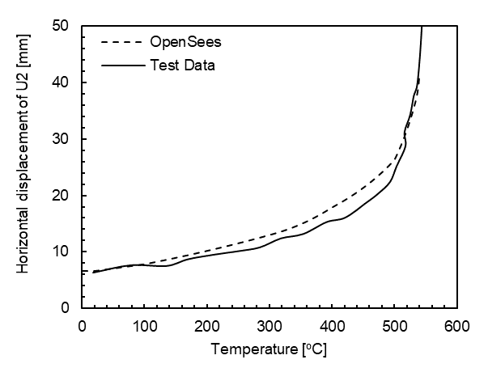

{.align-centeralign-center width="500px"}


Example overview: This example will combine the modeling methodologies
developed through the other examples and apply them to a two-bay frame
with a fire in one of the bays. Recorded data from the OpenSees analysis
will be compared with the experimental test data \[2\]. Heat transfer
analyses were performed using a commercially available finite element
program to calculate the temperature distribution through the cross
sections when the members are exposed to a linear gas time-temperature
curve. Horizontal displacement of upper corners, U1 & U2 are recorded.

Download Example 5 files:

[`Example5.tcl`](files/Example5.tcl)

[`WsectionThermal.tcl`](files/WsectionThermal.tcl)

`Example 5 Outputs <files/Example5_OUTPUT.zip>`{.interpreted-text
role="download"}.

### Objectives

Example 5 Objectives: 1. Create a two-bay frame in OpenSees using
displacement-based elements with tempurature-dependent material
properties, 2. Implementing user-defined time-tempurature histories for
the elements calculated through heat transfer analysis, and 3. Compare
recorded parameters from the OpenSees model to experimental testing data
\[2\] to benchmark modeling methodologies.

**Experimental Test Overview**

A two-bay frame was tested by researchers \[2\]. Each bay size was 1.2 m
in width and 1.18 m in height. Point loads were applied at the
beam-column joints in the lateral and gravity directions in addition to
a uniformly distributed load applied to the beams. The columns and beam
of one of the bays was heated using electrical heaters that surrounded
each of the members, therefore, uniformly heating each member (there was
no thermal gradient through the cross section). The temperature was
increased until failure.

### Material

The uniaxialMaterial Steel01Thermal includes temperature-dependent steel
thermal and mechanical properties per Eurocode 3 \[1\]. More details of
Steel01 can be found at: [Steel01 Material](https://opensees.berkeley.edu/wiki/index.php/Steel01_Material)

- Es = 210 GPa (Young's modulus of elasticity at ambient temperatures)
- Fy = 355 MPa (Yield strength of material at ambient temperatures)
- b = 0.001 (Strain-Hardening Ratio)

```tcl
set matTag 1;

uniaxialMaterial Steel01Thermal $matTag $Fy $Es $b;
```

### Transformation

Because the beams and columns in this example experience bending, 2nd
order bending effects were considered using the Corotational geometric
transformation.

```tcl
geomTransf Corotational $transftag;
```

Learn more about geometric transofrmations: [Geometric
Transformation](http://opensees.berkeley.edu/wiki/index.php/Geometric_Transformation_Command)

### Section

This example uses an external .tcl script to define the cross section.
This script uses fibersecThermal to procure a fibered W-shape section
with a section tag to be used while defining elements. Eight fibers are
used throughout the web and four fibers within each flange.

In previous versions of OpenSees, a default value for torsional
stiffness was used (GJ). In versions 3.1.0 and newer fiber sections
require a value for torsional stiffness. This is a 2D example with
negligible torsion, however a value is required. The Young's Modulus is
used for convenience. Wsection dimensions are (units are meters):

```tcl
set secTag 1; # section Tag 
set d 0.08; # depth of beam 
set bf 0.046; # flange width 
set tf 0.0052; # flange thickness 
set tw 0.0038; # web thickness
```

-   secTag - section tag
-   matTag - material tag
-   d = nominal depth
-   tw = web thickness
-   bf = flange width
-   tf = flange thickness
-   nfdw = number of fibers along web depth
-   nftw = number of fibers along web thickness
-   nfbf = number of fibers along flange width
-   nftf = number of fibers along flange thickness
-   Gj = torsional stiffness

```tcl
# WsectionThermal secTag matTag d bf tf tw nfdw nftw nfbf nftf Gj
WsectionThermal $secTag $matTag $d $bf $tf $tw 8 1 1 4 $Es
```

{.align-centeralign-center
width="500px"}

**Cross section of W-shape showing fibers in the flanges and the web**

### Element

dispBeamColumnThermal elements are used because temperature-dependent
thermal and mechanical steel properties can be applied to these
elements. Any portion of the structure that is being heated must use
elements that are compatible with uniaxialMaterial Steel01Thermal. At
the time this model was developed, dispBeamColumnThermal was the only
element type that could have tempurature-dependent thermal and
mechanical properties applied to them.


```tcl
# $eleTag $iNode $jNode $numIntgrPts $secTag $TransfTag;
element dispBeamColumnThermal 1 1 2 3 $secTag $transftag;
```

Each column and beam element is created using ten displacement-based
elements with 3 iteration points in each element.

### Output Recorders

`dataDir` is defined at the beginning of the model, this creates a
folder within your working directory where output files will be saved.

```tcl
set dataDir Examples/EXAMPLE5_OUTPUT;

file mkdir $dataDir;
```

displacements of node U1 (node 11, top left), DOF 1 (Horizontal
Displacement)

```tcl
recorder Node -file $dataDir/Midspan_BeamDisp.out -time -node 11 -dof 1
disp;
```

displacements of node U2 (node 22, top-middle), DOF 1 (Horizontal
Displacement)

```tcl
recorder Node -file $dataDir/Midspan_BeamDisp.out -time -node 22 -dof 1
disp;
```

Reaction forces at support nodes (1, 12 and 23):

```tcl
recorder Node -file $dataDir/RXNS.out -time -node 1 12 23 -dof 2 3
reaction;
```

Learn more about the Recorder Command: [Recorder
Command](http://opensees.berkeley.edu/wiki/index.php/Recorder_Command)

### Thermal Loading

In this model, the beams and columns of the left bay are heated by
increasing the temperature linearly from ambient temperature until
failure. The right bay remains at ambient tempurature.

Therefore, we set the maximum temperature as follows:


```tcl
set T 550; # Max Temperature, deg C
```

In OpenSees, the user can define 2 or 9 temperature data points through
the cross section. In a 2D analysis framework, like this example,
temperature data point locations are specified on the y-axis of the
local coordinate system (as shown in the figure above). And are linearly
interpolated between the defined points. Because this example is using a
uniformly heated beam, two temperature points on each extreme fiber on
the y-axis will be chosen. The beam has a depth of `d`, therefore, 
`Y1 = d/2` and `Y2 = -d/2` the top and bottom fibers respectively.

```tcl
set Y1 [expr  $d/2]; # Top fiber of beam
set Y2 [expr -$d/2]; # Bottom fiber of beam
```

**Location of defined input temperature locations on the member cross section (both beam and columns)**

{.align-centeralign-center width="500px"}

The bottom extreme fiber temperature must be defined first. The target
maximum temperature for each extreme fiber is set to 550 &deg; C and will
be increased linearly and incrementally as the time step continues in
the analysis. An external temperature data set can could also be used
for more complex temperature loading.

Using a for-loop and a plain linear loading pattern, elements 1-20 &
31-40 will be subjected to tempurature, `T`. These elements define the
heated bay.

```tcl
pattern Plain 2 Linear {

  for {set i 1} {$i <= 20} {incr i} { 
    eleLoad -ele $i -type -beamThermal $T $Y2 $T $Y1;
  }
  for {set i 31} {$i <= 40} {incr i} {
    eleLoad -ele $i -type -beamThermal $T $Y2 $T $Y1;
  }
};
```

### Thermal Analysis

Thermal loading is applied in 1000 steps, with a load factor of 0.001.
Each step is a 0.001 increment of the maximum temperature specified in
the thermal loading step: `T`. The analysis is a static analysis and the
contraints of the beam are plain. 1000 increments was also used during
thermal analysis to allow for easy correlation between the input
temperatures and the recorded output. Each step is an 0.001 increment of
the maximum temperature specified in the thermal loading step: `T`.

A variety of load factors were examined and the solution converged when
a load factor of 0.001 was used. OpenSees is sensitive to the load
factor, therefore, it is important to ensure that benchmarking examples
are performed to determine the proper load factor to use in structural
fire engineering analyses.

```tcl
set Nstep 1000

set Factor \[expr 1.0/$Nstep\];

integrator LoadControl $Factor;

analyze $Nstep;
```

### Output Plots

After the model has completed running, the results will be horizontal
displacements of the recorded node. Since the temperature was linearly
ramped up from ambient to 550 &deg; C, the user can develop a temperature
history that matches every increment of the model. The displacements are
benchmarked against test data \[2\] as shown in the figure below.

**Node U1 horizontal displacement versus temperature compared with the
testing data**

{.align-centeralign-center width="500px"}

**Node U2 horizontal displacement versus temperature compared with the
testing data**

{.align-centeralign-center width="500px"}

### Sources

\[1\] European Committee for Standardization (CEN). (2005). Eurocode 3:
Design of Steel Structures, Part 1.2: General Rules - Structural Fire
Design.

\[2\] Rubert A, Schaumann P. (1986). "Structural steel and plane frame
assemblies under fire action." Fire Safety Journal, vol. 10, pp.173--184.

